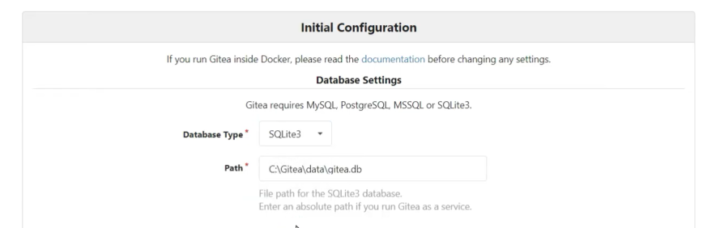
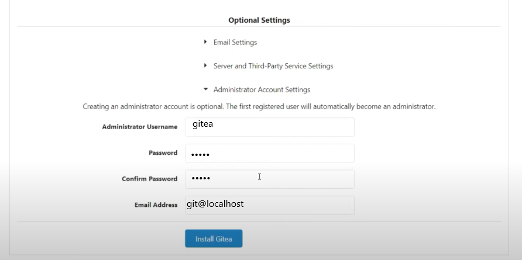
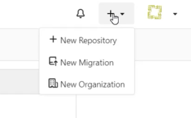
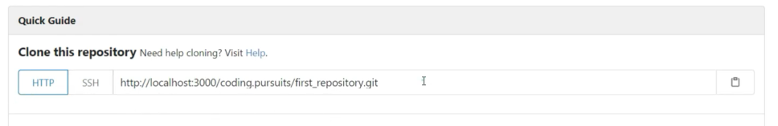

# **``{=html}Rapport Final SAé 2.03 : Installation de services réseaux**

***BOUTON Sacha***, ***CASTEUR Anaïs***, ***DEBACQ Arthur***.

` `{=html}

# Table des matières :

[Introduction](#intro)  
[Etape 1 : Création d'une machine virtuelle Debian](#Etape_1)  
&nbsp;&nbsp;- [1.1. Prérequis pré-installation de la machine virtuelle](#Etape1_1)  
&nbsp;&nbsp;- [1.2. Préparation de la machine virtuelle](#Etape1_2)  
&nbsp;&nbsp;- [1.3. Installation du système d'exploitation](#Etape1_3)  
[Etape 2 : Préparation du système](#Etape_2)  
&nbsp;&nbsp;- [2.1. Ajout d’un utilisateur dans le groupe d’utilisateur sudo](#Etape2_1)  
&nbsp;&nbsp;- [2.2. Installation de logiciels et paquets](#Etape2_2)  
&nbsp;&nbsp;- [2.3. Installation des suppléments invités](#Etape2_3)  
&nbsp;&nbsp;- [2.4. Installation de Claws-mail](#Etape2_4)  
&nbsp;&nbsp;- [2.5. Configuration du proxy](#Etape2_5)  
[Etape 3 : Sélection d'un front-end](#Etape_3)  
&nbsp;&nbsp;- [3.1. Sélection d'un front-end - Préliminaire](#Etape3_1)  
&nbsp;&nbsp;&nbsp;&nbsp;&nbsp;- [3.1.A. Configuration de Git](#Etape3_1_a)  
&nbsp;&nbsp;&nbsp;&nbsp;&nbsp;- [3.1.B. Gitk & Git-GUI](#Etape3_1_b)  
&nbsp;&nbsp;- [3.2. Sélection d'un front-end - Comparaison avec une autre interface graphique](#Etape3_2)  
&nbsp;&nbsp;&nbsp;&nbsp;&nbsp;- [3.2.A. Avantages](#Etape3_2_a)  
&nbsp;&nbsp;&nbsp;&nbsp;&nbsp;- [3.2.B. Inconvénients](#Etape3_2_b)  
[Etape 4 : Installation de Gitea](#Etape_4)  
&nbsp;&nbsp;- [4.1. Installation de Gitea](#Etape4_1)  
&nbsp;&nbsp;&nbsp;&nbsp;&nbsp;- [4.1.A. Installation et configuration de Gitea](#Etape4_1_a)  
&nbsp;&nbsp;&nbsp;&nbsp;&nbsp;- [4.1.B. Mises à jour potentielles](#Etape4_1_b)    
&nbsp;&nbsp;- [4.2. Utilisation basique de Gitea](#Etape4_2)  
&nbsp;&nbsp;&nbsp;&nbsp;&nbsp;- [4.2.A. Création d'un nouveau projet](#Etape4_2_a)  
&nbsp;&nbsp;&nbsp;&nbsp;&nbsp;- [4.2.B. Déposer des projets existants](#Etape4_2_b)  
&nbsp;&nbsp;- [4.3. Dépôt des rapports](#Etape4_3)  
&nbsp;&nbsp;- [4.4. Les différents modes d'accès réseau de VirtualBox](#Etape4_4)  
[Etape 5 : Finalisation du rapport](#Etape_5)  
[Conclusion](#conclu)  
[Sources](#Sources)  

` `{=html}

# Introduction : 

L'objectif de cette SAé consiste à **créer une machine virtuelle** avec son **système d'exploitation**, **2 utilisateurs**,quelques **logiciels de départ** ainsi qu'une **application permettant le travail collaboratif à distance**. Nous allons donc diviser ceci en plusieurs étapes afin d'**appronfondir les manipulations réalisées** et de **permettre la compréhension de tous en développant les termes technique employés**, ces étapes feront l'objet d'une **rédaction de rapports** en fichier Markdown puis le **rapport final sera sous la forme d'un fichier html**. Commençons tout d'abord par la création de la machine virtuelle Debian.

` `{=html}

# **``{=html}Etape 1 : Création d'une machine virtuelle Debian.**

## **``{=html}1.1. Prérequis pré-installation de la machine virtuelle.**

Afin de répondre à l'objectif il faut au **minimum** que votre ordinateur possède :  

1. 4 Gigaoctets de **RAM**,  
2. 20 Gigaoctets d'espace disque,  
3. Le logiciel [Virtual Box](https://www.virtualbox.org/) avec son ***extension pack*** nous verrons plus tard pourquoi l'extension pack est nécessaire.  

Le terme **RAM** est l'abréviation de ***« Random Access Memory »*** qui signifie « mémoire vive » ou littéralement « mémoire à accès aléatoire ». La RAM est un des **éléments fondamentaux** les plus importants de l'informatique. 
Il s'agit de l'**espace de stockage de données temporaires et ultra-rapide** auquel un ordinateur doit pouvoir accéder immédiatement ou dans les instants qui suivent.

Vous pouvez retrouvé l'installation du logiciel VirtuaBox dans la partie **Sources**.

Une fois que vous avez acqueris/vérifié les prérequis, nous pouvons passé à la préparation de la machine virtuelle via VirtualBox. 

## **``{=html}1.2. Préparation de la machine virtuelle.**

Nous allons maintenant lancer VirtualBox afin de créer notre toute première machine virtuelle, il suffit pour cela soit de cliquer sur le logo **"New"** ou **"Nouvelle"** en français trouvable sur l'interface graphique soit d'appuyer sur les touches du clavier **CTRL+N**.

Une fenêtre de dialogue s'ouvre et le début de la création de notre machine virutelle commence.
Lors de celle-ci il va falloir néanmoins respecter **des conditions**.

1. La machine doit être **nommé** "sae203",
2. La **distriution** (le type) doit être Linux,
3. La **version** doit être Debian-64-bits,

64 bits est une **version de l'AMD64 (64 bits)** qui est l'une des **architectures les plus communes du « grand public »**. 
Pour pouvoir installer une Debian AMD64, il faut un processeur **compatible** avec cette architecture
(ce qui est le cas pour tout les processeurs vendu dans un PC depuis quelques années).

4. La **taille de la taille mémoire** doit être fixé à 2048MégaOctets(Mo),
5. Créer un **disque dur virtuel** de **type VDI** (VirtualBox Disk Image), **dynamiquement alloué** et de **taille 20GigaOctets**(Go).

La création de notre machine est maintenant terminée et nous pouvons retrouver **la configuration** contenu dans un **fichier XML** à l'adresse :

`%homepath% \> virtualbox \> nom_de_la_vm \> sae20X.vbox-prev`

On peut notamment retrouver la **configuration réseau utilisée par Debian**. Par défaut **Debian est configurée en DHCP**. 
C'est à dire qu'elle est configurée pour **récupérer automatiquement son adresse IP** et toutes les **informations liée au réseau auprès d'un autre serveur spécialisé**.

## **``{=html}1.3. Installation du Système d'exploitation.**

La machine virtuelle maintenant crée, il faut maintenant **installer un système d'exploitation** pour ce faire il faut tout d'abord récupérer **une iso bootable** d'une installation de "Debian 11.2" ou supérieur. Nous pouvons retrouvé l'iso en cliquant sur ce [lien](https://www.debian.org/).

On pourrait se demander qu’est-ce qu’un **fichier iso bootable** ? Et bien, une **image disque** (ou image ISO) est un (voire plusieurs) **fichier(s) archive** proposant la **copie conforme d'un disque optique ou magnétique** (tel qu'il serait écrit sur celui-ci).

Une fois doté d'une iso bootable, nous pouvons **démarrer notre machine virtuelle** et séléctionnons l'iso que nous nous venons de nous procurer ainsi au démarrage nous nous retrouvons dans le **menu d'installation** par soucis de simplicité, nous allons utiliser **l'installation graphique** en appuyant sur la touche "Entrée" sur **"Graphical Install"**. 

Ainsi nous entrons donc dans le processus d'installation du système d'exploitation que nous allons suivre étape par étape :

1. Nous allons sélectionner **la langue Français** puis le **pays France** comme **langue et région de notre système**.  

2. Le **nom interne** de la machine doit être "serveur".  

3. **Pas de nom de domaine** donc nous passons cette étape en cliquant sur "Continuer".  

4. Nous devons dorénavant décider d'un mot de passe pour le **super utilisateur** par soucis de compréhension nous allons choisir comme mot de passe "root".  

5. Au tour du **nouvel utilisateur** de créer un login et un mot de passe que nous définirons simplement par le prénom pour le "login" et "root" pour le mot de passe.  

6. Du côté des **partitions des disques**, nous allons utilisé la méthode **"Assisté - utiliser un disque entier"** ensuite séléctionner **notre disque virtuel** que nous avons précedemment créer lors de la création de la machine virtuelle c'est sur celui-ci que notre système sera installé. Enfin, nous allons partitionné le **disque dans une seule partition** puis confirmer en sélectionnant "Terminer la partition et appliquer les changements".  

7. Afin de **compléter les logiciels présents sur le support d'installation** nous allons utiliser un **miroir**, nous allons donc sélectionner le miroir suivant : http://debian.polytech-lille.fr/  

8. Si vous réalisez l'installation depuis **le réseau de l'université** alors il vous faudra renseigner le **proxy** de celui-ci : http://cache.univ-lille.fr:3128/ sinon passer cette étape.

Pour en savoir plus, un **serveur proxy est une sorte de pont qui nous relie au reste d'internet**. Normalement,lorsqu'on navigue sur internet et qu'on se connecte directement au site qui nous intéresse, c'est un proxy qui
établit **la communication avec le site web** à notre place.

9. Le système de base étant installé, nous pouvons choisir et installer un ou plusieurs **ensembles prédefinies de logiciel** afin **d'adapter l'installation de nos besoins**. Comme illustré sur l'image ci-dessus, nous allons choisir (cocher) d'installer :

    1.**L'environnement de bureau Debian**,  
    2.**L'environnement de bureau MATE** (en veillant de bien décocher ...**GNOME**),  
    3.**serveur web**,  
    4.**serveur ssh**,  
    5.**utilitaires usuels du système**.     

Avant de finir l'installation faisons un point sur les **paquetages logiciels** que nous venons d'installer :  

***MATE*** est un **environnement de bureau** qui est la **continuation de GNOME 2**. Il fournit un environnement de bureau **intuitif** et **attractif** utilisant
les traditionnelles métaphores pour Linux et d'autres systèmes d'exploitation Unix. ***GNOME*** est un **environnement de bureau utile et attrayant**. Il est à la fois **libre et l'un des plus largement utilisés** des environnements de bureau sur le système d'exploitation GNU/Linux.

Un **serveur web transmet des documents** (d'une page web à un navigateur par exemple) à ce qu'on appelle **un client**. Le terme de serveur web peut en général se référer à deux choses différentes : soit au **logiciel d'un serveur web**, soit à la **machine sur laquelle s'exécute le programme**.  

Le **SSH (Secure Shell)**, désigne à la fois **un protocole de communication** et un **programme informatique**. Il permet la **connexion d'une machine distante** (serveur) via une **liaison sécurisée** dans le but de **transférer des fichiers** ou des **commandes** en toute sécurité.

10.  /!!!\ L'installation est maintenant fini cependant avant de continuer il faut IMPERATIVEMENT s'assurer que le lecteur optique de notre machine virtuelle soit vide sans quoi nous redémarrerons la machine sur l'iso et donc devrons ré-effectuer l'installation de l'OS (système d'exploitation). 

Si toute fois l'installation pose soucis le guide Debian est disponible en cliquant sur ce [lien](https://www.debian.org/doc/manuals/debian-handbook/sect.installation-steps.fr.html).

Félicitations nous avons **crée notre machine virtuel** et **installé notre système d'exploitation** ainsi que des paquetages qui nous faciliterons la vie dans les futurs étapes. Maintenant passons à la **configuration de notre utilisateurs**.  

` `{=html}

# **``{=html}Etape 2 : Préparation du système.**

## **``{=html}2.1. Ajout d'un utilisateur dans le groupe d'utilisateurs *sudo*.**

La commande `adduser user sudo` sert à ajouter un utilisateur dans le
groupe *sudo*, celui-ci accorde des privilèges d'administrateur.

Pour voir à quels groupes appartient l'utilisateur on utilise la
commande : `groups user`, en remplaçant user par le nom de
l'utilisateur.

  

## **``{=html}2.2. Installation de logiciels et paquets.**

Premièrement la commande
`apt install xterm vim curl git sqlite3 build-essential dkms linux-headers-$(uname-r)`
nous sert à installer des logiciels, paquets de tous genre utile pour
notre utilisation. Ces logiciels sont entres autre :

1.  *xterm* : Permets d'ouvrir en utilisant la commande `xterm` une
    **instance de terminal standard**.  

2.  *vim* : C'est un **éditeur de texte** sur GNU/Linux, il est qualifié
    d'**outil très puissant** grâce à ses diverses fonctions et
    raccourcis qui permettent de gagner du temps.  

3.  *curl* : Une interface en ligne de commande, destiné à **récupérer
    le contenu d'une ressource sur un réseau informatique**. Il est
    utilisé pour **récupérer des API(s)**.  

4.  *git* : Un **système de contrôle de version** d'un travail qui
    permet (via la commande `git`) de stocker un ensemble de fichiers en
    **conservant** la chronologie de toutes les **modifications**
    effectués sur ceux-ci, ce qui permet entre autre de **mutualiser**
    un développement.  

5.  *sqlite3* : Une **bibliothèque** qui propose un moteur et un
    **langage SQL** permettant la **manipulation sur base de données
    relationnelle**.  

6.  *build-essential* : Un **ensemble de paquet essentiel à
    l'utilisation de divers logiciels**, compilateur de C/C++, outil de
    dépaquetage, etc.  

7.  *dkms* : **Framework** (environnement de développement) qui permet
    (via la commande `dkms`) de **générer des modules du noyau Linux**
    dont les sources résident généralement en dehors de **l'arbre des
    sources du noyau**. Cela signifie qu'un utilisateur n'a pas à
    attendre qu'une entreprise, un projet ou un mainteneur de paquet
    publie une nouvelle version du module.  

8.  *linux-headers-\$(uname -r)* : Un paquet fournissant les
    **linux-kernel-headers** (fichiers d'en-têtes du noyaux linux). Les
    **linux-kernel-headers** contiennent **les API** (fichiers décrivant
    la syntaxe à respecter pour être compris par le noyau quand on lui
    demande quelque-chose) offertes par le noyau Linux. Ces fichiers
    sont **nécessaires** pour compiler des programmes utilisant ces API
    **ce qui va nous être utile pour l'étape suivante, l'insatllation
    des supplément invités**.

## **``{=html}2.3. Installation des suppléments invités.**

Les **suppléments invités** ou **Additions invité** comprennement des
pilotes de périphériques et des applications système. Il est **plus que
recommandé** de les installer car ces pilotes et applications
**optimisent le système d'exploitation** pour de **meilleures
performances** et **une utilisation optimale** via des fonctionnalités
utiles telle que le presse-papiers bidirectionnel, le glisser-déposer ou
encore le redimensionnement automatique.

Afin d'ajouter les supplément invités, il nous faut, comme vu
précédemment, des outils de compilations et les fichiers d'en-têtes du
noyaux linux. Pour **connaître quel est le noyau Linux utilisé par notre
VM** nous pouvons taper dans un terminal la commande suivante :
`uname -a` ce qui nous retournera **la version de son noyau Linux**
utilisé, **son nom**, etc. Dans notre cas, le noyau Linux utilisé est
***Linux***.

Pour ceci nous allons utilisé **l'image CD des additions invités** via
VirtualBox puis le monter grâce à la commande :  
`sudo mount /dev/cdrom /mnt`.

La commande `mount` permet de **manipuler tous les montages de systèmes
de fichier** de manière très précise. Par exemple, pour monter l'unité
de stockage */dev/cdrom* dans le dossier */mtn*, le dossier */mtn* doit
être un dossier **existant** et **vide**.

Une fois **le CD monté**, Nous pouvons installer les suppléments en
exécutant le script *VBoxLinuxAdditions.run* via la commande :  
`sudo /mnt/VBoxLinuxAdditions.run`\
Notre machine est maintenant prête pour une utilisation confortable.
Enfin pas tout à fait, il nosu manque un service de messagerie
éléctronique afin d'assurer la communication.

## **``{=html}2.4. Installation de *claws-mails*.**

  

Pour cette SAé, nous allons installer le client de courriel **rapide**,
**facile à utiliser** et **puissant** grâce à ses fonctionnalités
avancées (RSS aggregator, calendar, ou laptop LED handling,ect..),
**Claws mail**. La configuration (import/export de mails) avec Claws
mail est **simple à souhait** grâce à son **interface** et ses
**commandes toutes accessibles au clavier**.

L'installation n'est pas plus compliqué, il suffit d'ouvrir un terminal
et de taper la commande suivante :  
`apt-get install claws-mail claws-mail-plugins claws-mail-extra-plugins claws-mail-i18n`

Ce qui nous installeras **Claws mail** ainsi que les **extras-plugins**
(fonctionnalité avancées). Lors du premier lancement, Claws Mail propose
un **assistant de configuration** pour se connecter à sa messagerie et
ainsi configurer son compte messagerie avec une adresse mail.

-   ## **``{=html}2.5. Configuration du Proxy.**

Au sein de l'université, nous devrons utilisé un **proxy**, il nous
serait donc très utile d'en configurer un. Pour ce faire il y a deux
solutions disponibles :\
1. ***Configuration pour un logiciel particulier*** : Comme git ou apt,
certains logiciels sont **capables de gérer un proxy** pour leur propre
utilisation. Cependant dans notre cas, nous allons procéder à une
configuration générale.

2.  ***Configuration générale***
    1.  Ouvrir un terminal et **se placer dans le répertoire** *\$HOME*
        via la commande `cd <destination>`.

    2.  Via la commande `nano .bashrc` **ajouter les lignes** suivante
        dans le fichier *.bashrc*:\
        `export http_proxy=http://cache.univ-lille.fr:3128`\
        `export https_proxy=$http_proxy`.

    3.  Cette méthode de configuration du proxy permet **d'éviter
        d'avoir à saisir les commandes précédente à chaque fois**.

    4.  Pour **désactiver le proxy**, il suffit de taper dans un
        terminal la commande suivante : `unset http_proxy`.\

` `{=html}

# **``{=html}Etape 3 : Séléction d'un front-end.**

## **``{=html}3.1. Séléction d'un frontend - Préliminaire.**

-   #### **``{=html}3.1.A. Configuration de ***Git***.**

Dans un premier temps, nous allons commencer par **configurer notre
identité** sur ***Git*** pour notre compte utilisateur. La commande
`git config` permet de spécifier les paramètres de configuration de
***Git*** et de cette manière utiliser Git de manière plus
**personnalisée**.

Ainsi, nous pouvons configurer notre identité **(constitué du couple
Prénom/Nom et notre email)** à l'aide des commandes ci-dessous : 1.
`git config --global user.name "Prénom Nom"`\
2. `git config --global user.email "votre@email"`

Exemple :

L'identité est une **information importante** car **toutes les
validations** dans ***Git*** utilisent cette information et elle est
**indélébile** dans toutes les validations que vous pourrez réaliser.

Dans un même temps, nous allons configurer **le nom de la branche par
défaut**. En effet, par défaut ***Git*** crée une branche nommée
***master*** quand vous créez un nouveau repository avec `git init` en
éxécutant la commande ci-dessous cela permet d'éviter le warning
concernant la création d'une branche par défaut.

`git config --global init.defaultBranch "master"`

-   #### **``{=html}3.1.B. ***Gitk*** & ***Git-GUI***.

***gitk*** permet d'**afficher sous forme d'arbre** l'**historique de
notre dépôt**. Pour chaque commit on peut y obtenir des informations
comme **le message de commit**,l'**arboresence** ainsi qu'**une vue** de
ce qu'elle contient. Le logiciel ***gitk*** n'a pas d'installation
requise, il est déjà integré avec ***git***.

***git-gui*** est l'**interface de base de ***git***, on peut
l'utiliser pour créer des dépôts** facilement, **cloner un dépôt** et
d'**ouvrir le dernier dépôt**. De son côté, il se pourrait que
***git-gui*** ne soit pas installé, pour y remédier il suffit de taper
la commande `sudo apt-get install git-all` qui permet d'installer les
packages supplémentaires.

## **``{=html}3.2. Séléction d'un frontend - Comparaison avec une autre interface graphique.**

Nous allons maintenant comparer l'interface de git-gui par rapport à une
autre afin d'y cerner les avantages/inconvénients de celles-ci. Pour
ceci, nous avons décidé d'installer l'interface ***SmartGit*** car il
est facile d'installation et facile d'utilisation ce qui avantagera un
utilisateur avec peu d'expérience. L'installation de cette interface a
été effectué via les commandes suivante :\

1. Récupérer **l'archive tar.gz** sur le site internet.
(https://www.syntevo.com/smartgit/) 

2. `tar xzf <nom_de_l'archive>` (Extraire l'archive),

3. `bin/smartgit.sh` (se rendre dans le répertoire bin de l'arboresence extraite puis **éxecuter** le script *smartgit.sh*),

4. `bin/add-menuitem.sh` (Ajout de smartgit dans le menu des applications).

-   #### **``{=html}3.2.A. Avantages.**

Facilité d'installation sur toutes les plateformes (sauf pour le serveur
sur Windows)\
Facilité d'utilisation.\
Il y a une vue pour voir les logs.\
La vue de « treeview » et le résumé des fichiers modifiés et la facilité
de faire d'une fonctionnalité sont explicite.\
Branches locales et branches publiques\
Fonctionnalité pour mettre de côté temporairement des modifications sans
les commiter\
La fonction « cherry-pick » pour pouvoir fusionner certains commit
seulement\
Les commits sont en local seulement jusqu'au moment où on les « push »\
Facile de revenir avec un checkout à un état passé de l'architecture.

-   #### **``{=html}3.2.B. Inconvénients.**

L'interface peut être gourmande en ressource et sur certaines machines
elle peut être de ce fait lente.\
Ne se met pas à jour automatiquement, l'utilisateur doit appuyer sur F5
pour rafraîchir la vue car il n'y a pas de mise à jour automatique
disponible.

` `{=html}

# **``{=html}Etape 4 : Installation de Gitea.**

Au cours des étapes précédente nous avons eu l'ocassions d'installer et configurer le logiciel de contrôle de version ***Git***. Cependant,  nous allons installer une autre application permettant un travail collaboratif à distance nommé ***Gitea*** néanmoins l'installation de git reste **essentiel** car Gitea est basé dessus.  

  
Avant tout qu'est-ce-que ***Gitea*** ? ***Gitea*** est une **forge libre** (système de gestion et de maintenance collaborative de texte qui permet de rassembler des projets et des développeurs dans l'objectif de permettre à plusieurs développeurs de participer ensemble au développement d'un ou plusieurs logiciels, le plus souvent à travers le réseau Internet) développé via le langage de programmation inspiré de C et Pascal de Google, ***Go***. Destiné principalement pour **l'hebergément de développement logiciel**, il comporte aussi un **système de suivi des bugs**, un **wiki** ce qui peut être utile pour les novices, des **outils de relecture de code** et également un **système d'extentions**. Il peut être comparé comparer à GitLab ou encore à GitHub.

## **4.1. Installation de ***Gitea***.**  

* #### **4.1.A. Installation et configuration de ***Gitea***.**

Pour l'installation nous allons nous référer à la [documentation officiel](https://docs.gitea.io/fr-fr/install-from-binary/) ainsi que des **sites web externes** (lien dans les sources) en ne prenant qu'en compte l'installation à partir des **binaires**. L'installation avec le bianire pré-compilé nécessite un support de système de gestion de bases de données relationnelles tel que ***MySQL***, ***PostgreSQL*** ou encore celui que nous avons précedemment installé ***SQLite*** il est donc nécessaire d'avoir suivi les étapes précedentes pour le bon déroulement des suivantes.

Avant toute chose nous allons **mettre à jour notre environnement** à l'aide des commandes suivantes :  
`apt update` suivi de `apt upgrade`

Une fois fait, afin d'obtenir le binaire deux choix s'offre à vous :  

1. Il suffit de choisir le fichier correspondant à votre plateforme à partir de la [page de téléchargement](https://dl.gitea.io/gitea).
2. Executez, dans un terminal, la commande suivante : `wget -O gitea https://dl.gitea.io/gitea/1.16.8/gitea-1.16.8-linux-amd64`

Le binaire étant téléchargé, rendez vous dans le répertoire ou il se situe grâce à un terminal et la commande `cd <destination>`. Maitenant il va falloir rendre le binaire **éxecutable** avec la commande :

`chmod +x gitea`

La commande `chmod` permet de **changer les permissions d'accès d'un fichier ou d'un répertoire**, dans notre cas on ajoute l'autorisation d'éxecution avec le `+x` à notre binaire `gitea` ce qui permet de rendre notre binaire éxecutable.

Après avoir suivi les étapes ci-dessus, vous aurez un binaire `gitea` dans votre répertoire de travail, nous allons maintenant éxecuter la version web de notre binaire grâce à la commande suivante :  

`./gitea web`

Ceci heberge un serveur sur le localhost, nous pourrons donc avoir accès à **l'interface web de gitea** herbergé **localement** sur notre machine en accédant à l'adresse donné par gitea avec le port 3000 : [http://127.0.0.1:3000](http://127.0.0.1:3000) (127.0.0.1 est une adresse qui réfère votre propre machine)

Depuis **l'interface web** nous allons maintenant **installer** et **configurer** Gitea. Rendez-vous sur la [page d'installation](http://127.0.0.1:3000/install) et en premier lieu vous pouvez observer les **Database Settings** qui sont tout simplement nos paramètres concernant la base de données, comme indiqué dans la capture d'écran ci-dessous le type de base de données **doit** être celui que nous avons installé précedemment c'est à dire ***SQLite3***, ainsi dans le menu déroulant **veuillez choisir ***SQLite3***** et laisser **les autres paramètres par défaut** nous n'avons pas besoin d'y toucher sauf pour si vous voulez changer le nom du site dans le paramètre intitulé **Site Title**.

Avant de finaliser notre installation et configuration, situé dans **les paramètres optionnel** nous allons **ajouter un compte administrateur** qui aura pour :

1. **nom d'utilisateur** : gitea
2. **mot de passe** : gitea
3. **email** : git@localhost

Ceci étant fait, nous pouvons désormais **finaliser l'installation** en cliquant sur le **bouton bleu "Install Gitea"**.

* #### **4.1.B. Mise à jour potentielles.**

Gitea maintenant installé sur votre machine possède **une version propre**, des **version futurs sortiront** de ce fait pour vérifier si **votre version du programmme** est celle en date il faut comparer **la dernière version du programme affiche** sur la [page de téléchargement](https://dl.gitea.io/gitea) et **la votre** en éxecutant la commande `gitea --version`.

Si votre version est à mettre à jour, alors il suffit de remplacer l’ancien binaire par le nouveau et de relancer le service associé :

`systemctl stop gitea`  
`VERSION=$(wget --quiet https://dl.gitea.io/gitea/version.json -O - | cut -d \" -f 6)`  
`wget -O /usr/local/bin/gitea https://dl.gitea.io/gitea/${VERSION}/gitea-${VERSION}-linux-amd64 && chmod +x /usr/local/bin/gitea`  
`systemctl start gitea`

## **4.2. Utilisation basique de ***Gitea***.**

* #### **4.2.A. Création d'un nouveau projet.**

Nous allons maintenant aborder la **création d'un nouveau projet/dépôt** pour cela rien de plus simple, **tout en étant sur l'interface web** hebergé localement sur notre machine, il suffit de vous **connecter avec notre compte administrateur** fraichement crée. Une fois fait, nous allons y trouver un petit symbole **'+'** un menu déroulant s'ouvre à nous et nous n'avons plus qu'à cliquer sur **'New Repository'** pour créer un nouveau dépôt.

En cliquant sur **'New Repository'**, nous tombons sur une page avec tout un tas d'informations à compléter tel que le **nom du dépôt**, le **propriétaire**, la **visibilité de celui-ci**, **une description** ces informations que nous sommes libres de modifier sauf à une exception près nous allons, comme sur la capture d'écran ci-dessus, **cocher l'option d'initialiser le répertoire** ce qui va nous permettre de ne pas perdre de temps à créer un **ficher README**. Nous pouvons finaliser la création de notre dépôt et maintenant **cloner notre dépôt sur notre machine** en copiant l'adresse de notre dépôt (capture d'écran ci-dessous) puis dans un terminal executez la commande suivante : 

`git clone <adresse_dépôt_git>`

 
**Cloner un dépôt git** consiste à **copier le dépot ainsi que son contenu** de gitea/git à votre machine local. 

Après cela, dans notre répertoire nous retrouvons le contenu de notre dépôt avec notre fichier README d'extension **.md**. Un fichier .md est un **fichier de texte simple qui ne contient aucun autre élément**. À l’aide de **symboles intégrés** dans les lignes, vous avez la possibilité de **définir la mise en forme de sections de texte**. Par exemple, encadrez un mot ou une autre portion de texte de deux astérisques pour les mettre en gras. L’extension **.md**, **parfois aussi .markdown**, signifie ***« Markdown Documentation »***. **Markdown est un langage de balisage simplifié** contrairement à HTML, par exemple, il est **plus facile à lire par les utilisateurs humains**.

Nous allons modifier ce fichier README.md en y ajoutant des caractères, des mots, des phrases peu importe tant qu'**il n'est pas vide**. Enregistrons notre fichier non vide maintenant et **essayons de mettre à jour le fichier README vide de notre dépôt sur gitea**. Pour cela rendez-vous dans notre répertoire du projet à l'aide du terminale et éxecutez l'ordre des commandes suivantes de manières à mettre à jour notre dépôt :

1. `git add README.md`
2. `git commit -m "Mise_à_jour_README"`
3. `git push origin master`

Si vous avez correctement suivi les étapes, le fichier README.md devrait alors avoir été mis à jour dans votre dépôt gitea.

* #### **4.2.B. Déposer des projets existants.**

Nous avons vu comment créer des nouveau dépôts mais il pourrait être désirable de **déposer des projets déjà existants**. Nous avons donc **essayer de cloner un projet tel que l'une de nos ressources (dev-oo ayant un dépôt sur gitlab)** mais cela ne marche visiblemment pas car les modes d'accès réseau sont différents. 

## **4.3. Dépôt des rapports.**

Maintenant il serait intéressant de **créer un dépôt pour y ajouter tout nos précédents rapports avant la rédaction de celui final**. Nous avons donc créer **un projet nommé "projet_sae" en suivant les étapes précédentes** et en y ajoutant les rapports **d'abord en local** puis dans le dépôt avec les commandes suivantes : 

1. `git add rapport_1.md rapport_2.md rapport_3.md rapport_4.md`
2. `git commit -m "Add_rapports"`
3. `git push origin master`

## **4.4. Les différents modes d'accès réseau de VirtualBox.**

Dorénavant, il serait utile de pouvoir **gérer nos projets sur la machine qui héberge** et **non uniquement sur la machine virtuelle**. Nous allons rendre cela possible grâce a **la redirection des ports**. 

Pour **comparer cette nouvelle interface** nous avons voulu aussi utiliser ***gitweb*** qui est un **script CGI** fournit par Git. Le terme **CGI** désigne **une interface utilisée par les serveurs HTTP**. Au lieu d'envoyer le contenu d'un fichier (fichier HTML, image), le serveur HTTP **exécute un programme, puis retourne le contenu généré**.

Afin de démarrer [le scrpit gitweb](https://git-scm.com/book/fr/v2/Git-sur-le-serveur-GitWeb) il est nécessaire **d'éxecuter la commande ci-dessous** qui va **démarrer un serveur HTTP sur le port 1234** et lancer automatiquement un navigateur Internet qui ouvre la page d’accueil.

`git instaweb --httpd=webrick`

Nous n'avons plus qu'à **rediriger les ports de ces 2 interfaces**. Désormais, nous pouvons créer un nouveau projet Gitea à partir d’un de nos projets existant sur notre machine et non uniquement sur la machinne virtuelle.

Pour aller plus loin, comparons Gitea, gitweb et SmartGit pour en décerner les avantages,inconvénients et spécificités de chacun.

|               	| ***smartgit***                                | ***gitea***                           | ***gitweb***                                  |
|---------------	|-------------------------------------------	|------------------------------------	|--------------------------------------------	|
| **avantages**     |                                             	| Accès via navigateur                 	| Idem                                         	|
|               	| Idem                                         	| Interface simple                     	| Idem                                         	|
|               	| Idem                                         	| Performant et flexible             	| Idem                                         	|
|               	| Idem                                        	| Utilisable en entreprise           	| Idem                                         	|
|               	| Idem                                        	| Support très présent               	| Idem                                         	|
|               	|                                           	| Leger                              	| Idem                                         	|
|               	| Facilité d'utilisation                       	| ""                                   	|                                            	|
|               	| Fonctionnalités utiles (c.f cherry-pick)      |                                     	|                                           	|
| **inconvenients** |                                             	|                                    	|                                            	|
|               	| Gourmande en ressources                      	|                                     	|                                            	|
|               	| Pas de mise à jour automatique               	|                                     	|                                            	|
|               	|                                           	| Installation pas intuitive          	|                                            	|
|               	|                                            	|                                    	| Manque de fonctionnalité                     	|
|               	|                                           	|                                    	| impossible d'importer des projets existant 	|
| **specificités**  |                                              	| hébergement en local                 	| Idem                                         	|
|               	|                                           	| fonctionne avec une base de donnée 	|                                            	|
|               	|                                           	| nombre de fonctionnalité accrue    	|                                            	|
|               	| représentation graphique des branches       	|                                     	|                                            	|

` `{=html}

# **``{=html}Etape 5 : Finalisation du rapport.**

  

Pour réaliser **le rapport final sous HTML** comme indiqué dans l'introduction, il va falloir **fusionner nos 4 rapports précedents** constituant chacun une étape puis y ajouter une **introduction**, une **conclusion** et une **table des matières** pour rendre la navigation plus fluide et pour finir convertir l'ensemble en fichier HTML. Pour se faire nous allons utiliser le logiciel prénommé ***Pandoc***, ***Pandonc*** est un **puissant logiciel de conversion de documents en ligne de commande**. Il converti vers et depuis de **multiples formats**. Mais son intérêt réside surtout dans **l'automatisation de tâches** et la possibilité d'utiliser des modèles (templates) pour obtenir des produits de conversion. La commande Pandoc supporte plusieurs options servant à **conditionner la conversion** ou **mettre en page** la sortie demandée.

Nous devons donc dans un premier temps installer le logiciel Pandoc, en consultant la [documentation officielle de Pandoc](https://pandoc.org/installing.html#linux) nous nous sommes rendus compte que l'installation était très simple et rapide.  

En effet, dans un premier temps il suffit de **récupérer le paquet Debian correspondant à notre architecture** sur la [page de téléchargement](https://github.com/jgm/pandoc/releases/tag/2.18), dans notre cas nous avons une architecture **amd64**.  

Maintenant, ouvrons un terminal et à l'aide de la commande `cd <destination>` vu et revu, plaçons nous dans le **répertoire où le paquet Debian a été télechargé**. Ensuite, il ne reste plus qu'à éxecuter la commande suivante pour installer le logiciel ***Pandoc***:  

`sudo dpkg -i <nom_du_paquet>`  

La commande `dpkg` est l'**outil gérant les paquets des distributions basées sur Debian**, l'option `-i` signifie `--install` et indique que l'on veut installer le paquet. Ainsi, nous pouvons vérifier si ***Pandoc*** est installé en executant la commande :  

`pandoc --version`  

Si cela nous retourne la version de ***Pandoc*** alors celui-ci est bien installé sur votre machine. Dorénavant, nous allons l'utiliser pour **fusionner nos rapports** mais avant toute chose il faut d'abord se placer dans le repértoire de nos rapports. Ceci étant fait, nous pouvons entrer la commande suivante afin de **fusionner nos 4 rapports en un seul nouveau fichier Markdown** ce qui nous facilitera la vie :  

`pandoc rapport_1.md rapport_2.md rapport_3.md rapport_4.md -f markdown -t markdown -s -o rapport_final.md`  

L'option `-f` signifie **from** qui est notre **type de fichier de départ** tandis que l'option `-t` signifie **to** qui est notre **type de fichier que l'on souhaite en sortie**. L'option `-o` indique tout simplement le **nom du nouveau fichier** que l'on souhaite donné après conversion. Donc ici, nous voulons fusionner nos 4 rapports en les indiquant tous puis nous voulons les convertir en 1 seul fichier markdown nommé rapport_final.md.

Une fois en possesion du nouveau fichier fusionnant les rapports, nous pouvons ajouter notre tables des matières, notre introduction et notre conclusion. Lorsque vous serez satisfait de votre création, il n'y aura plus qu'**une seule étape**, la **conversion en page HTML** réalisable grâce à la commande suivante :  

`pandoc rapport_final.md -f markdown -t html -s -o rapport_final.html`  

Suite à cela, nous obtenons un **fichier contenant l'ensemble de ce que nous avons réalisé converti sous format HTML ouvrable dans un navigateur**. Maintenant libre à nous de le personnaliser comme nous le voulons en y rajoutant de le couleur ou autre. Malheuresement, nous nous sommes rendu comptre trop tard que **l'option** `--toc` permettait de **générer automatiquement une table des matières** et de ce fait nous avons manuellement intégrer une table des matières avec la balise <a> du langage HTML.   

` `{=html}

# Conclusion   

En conclusion, au travers de cette SAé nous avons appris à **créer et préparer un environnement de travail virtuel** en passant d'abord par la création de la machine virtuelle, l'installation de l'OS, la préparation du système, la sélection d'un front-end et enfin l'installation et l'utilisation de **notre objectif principale**, l'**application permettant un travail collaboratif à distance** Gitea. Nous avons également appris à **nous documenter**, **réferer**, **à chercher** ainsi qu'à **lire** **la documentation officielle des sites** pour nous aider tout au long de la phase d'installation. Apprendre c'est bien mais retransmettre c'est encore mieux, c'est pourquoi nous avons mêmement appris à **rédiger des rapports** sur ce que nous avions fait de manière à ce que cela soit plus **le plus compréhensible possible** et ce pour tout les catégories de personnes ainsi **une personne n'ayant quasi aucune notion en informatique** peut suivre ce rapport et **comprendre les actions réalisées**. De plus, la rédaction de ces rapports à été effectué dans le langage de balisage Markdown, nous avons donc appris à **maîtriser la syntaxe et la mise en forme** ainsi que la **conversion d'un fichier Markdown en une page HTML** via l'outil Pandoc. Cependant, pour les gens pressés le rapport peut-être très long à lire c'est pourquoi nous avons appris à **réaliser une carte mentale** et à **maîtriser l'outil XX** permettant de **visualier les informations important de manière synthétique et récapitulative** de chaque rapports via des **mots et des expressions-clés**.  

` `{=html}

# Sources : 

[Documentation Gitea (Installation via les binaires)](https://docs.gitea.io/fr-fr/install-from-binary/)  
[Wikipédia Gitea](https://fr.wikipedia.org/wiki/Gitea)  
[Qu'est-ce-que l'adresse 127.0.0.1 ?](https://www.tutomiel.com/adresse-ip-127001-64490.htm)  
[Wikipédia Commande chmod](https://fr.wikipedia.org/wiki/Chmod)  
[Qu'est-ce-qu'un fichier md ?](https://www.ionos.fr/digitalguide/sites-internet/developpement-web/quest-ce-quun-fichier-md/)  
[Documentation VirtualBox](https://www.virtualbox.org/manual/UserManual.html#networkingdetails)  
[Gitea Installer](https://github.com/flobee/gitea-installerScript)  
[Common Gateway Interface](https://fr.wikipedia.org/wiki/Common_Gateway_InterfaceWikipédia)  
[Documentation d'installation SmartGit](https://www.syntevo.com/smartgit/download/#installation-instructions/)  
[Qu'est-ce-que Gitk ?](http://codeur-pro.fr/gerer-son-historique-visuellement-avec-gitk)  
[Qu'est-ce-que Git-GUI ?](http://codeur-pro.fr/git-gui-guide-complet/)  
[Article SmartGit #1](https://ubunlog.com/fr/smartgit-interfaz-usuario-trabajar-git-ubuntu/)  
[Article SmartGit #2](https://david.gregoire.ca/tag/smartgit)  
[Wikipédia Claws-Mail](https://fr.wikipedia.org/wiki/Claws_Mail)  
[Wiki Linux-headers](https://wiki.gentoo.org/wiki/Linux-headers)  
[Wikipédia Xterm](https://fr.wikipedia.org/wiki/Xterm)  
[Wikipédia Vim](https://fr.wikipedia.org/wiki/Vim)  
[Wikipédia Curl](https://fr.wikipedia.org/wiki/CURL)  
[Wikipédia Git](https://fr.wikipedia.org/wiki/Git)  
[Wikipédia SQLite](https://fr.wikipedia.org/wiki/SQLite)  
[Wikipédia DKMS](https://fr.wikipedia.org/wiki/Dynamic_Kernel_Module_Support)  
[Article Installation Additions invités](https://lecrabeinfo.net/virtualbox-installer-les-additions-invite-guest-additions.html)  
[Documentation ubuntu mount](https://doc.ubuntu-fr.org/mount_fstab)  
[Wikipédia Proxy](https://fr.wikipedia.org/wiki/Proxy)  
[Documentation git gitconfig](https://git-scm.com/book/fr/v2/Personnalisation-de-Git-Configuration-de-Git)  
[Documentation git gitk](https://git-scm.com/docs/gitk/)  
[Article Git-GUI](http://codeur-pro.fr/git-gui-guide-complet/)  
[Site web SmartGit](https://www.syntevo.com/smartgit/)   
[Documentation SmartGit](https://docs.syntevo.com/SmartGit/Latest/)  
[Qu'est-ce-que Pandoc ?](https://framalibre.org/content/pandoc)  
[Wikipédia Pandoc](https://fr.wikipedia.org/wiki/Pandoc)  
[Documentation Pandoc (installation)](https://pandoc.org/installing.html#linux)  
[Documentation Pandoc (utilisation)](https://pandoc.org/getting-started.html)  
[Documentation Ubuntu DPKG](https://doc.ubuntu-fr.org/dpkg)  

